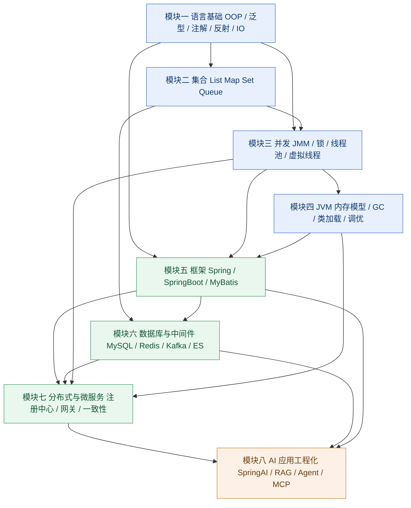

# 第 0 章 需求侧洞察与知识全景

> 摘自《Java 面试全栈通关指南》——192 道题 / 17 个模块，覆盖 Java 后端与 Java AI 应用开发，
> 其中第 13–16 章为**真实业务场景题**（每题先给业务约束与量级，再渐进追问）。
> 在线阅读（可搜索、自测、记进度）：https://java-interview-guide.app.workbuddy.host/

---

### 0.1 招聘需求侧分析（2026 年 9 月检索）

**信息来源类型说明**（本章所有时效性结论均来自以下五类公开来源，未使用记忆性数据）：

| 来源类型 | 具体样本 | 用途 |
|---|---|---|
| 主流招聘平台公开 JD | 全职招聘网（Java agent 开发工程师、Java(AI应用)、JAVA开发工程师(AI)、AI应用开发工程师）、猎聘系灵活用工岗位、市北人才网 AI 集成岗 | 社招技能关键词统计 |
| 高校就业信息网校招 JD | 中国科学技术大学就业网、郑州轻工业大学就业创业信息网、安徽省大学生就业服务平台 | 应届/初级岗位能力基线 |
| 外企英文 JD | EPAM《Senior AI & Agentic Systems Engineer (Java)》 | 英语面 + 国际化要求对照 |
| 行业生态报告 | Azul《State of Java Survey 2026》（Dimensional Research，n=2039）、Incus Data《State of the Java Ecosystem: March 2026 Update》、Keyhole Software《Java Trends of 2026》 | 版本占比、AI 渗透率等量化数据 |
| 官方发布日志/技术社区 | Oracle Java 26（2026-03-17）、Spring AI 1.0 GA（2025-05-20）→1.1 GA（2025-11-12）→2.0.0-M4（2026-03-26）、JetBrains Koog for Java（2026-03-17）；CSDN/DEV 社区 2026 面经 | 精确版本号与新增考点 |

**样本口径**：共收集并通读 **15 份公开 JD**，其中传统 Java 后端岗 6 份、Java AI 应用开发岗 9 份。下表频次为该小样本中的出现占比，**用于判断"是否值得投入复习时间"的相对排序，不是全市场精确统计**。

#### 0.1.1 技能关键词热度表

| 技能关键词 | 后端岗出现频次 | AI 应用岗出现频次 | 重要度 |
|---|---|---|---|
| Spring Boot | 6/6 | 9/9 | 高 |
| MySQL / Oracle / PostgreSQL（含 SQL 优化） | 6/6 | 7/9 | 高 |
| Java 语言核心（集合 / 多线程 / IO） | 6/6 | 8/9 | 高 |
| Spring Cloud / 微服务（Nacos/Feign/Gateway/Sentinel） | 5/6 | 6/9 | 高 |
| Redis | 5/6 | 6/9 | 高 |
| 消息队列（Kafka / RabbitMQ / RocketMQ） | 5/6 | 5/9 | 中 |
| 向量数据库（Milvus / Qdrant / FAISS / pgvector / ES 向量） | 0/6 | 8/9 | 高 |
| RAG / 向量检索 / 知识库 | 0/6 | 9/9 | 高 |
| LLM API 调用与对接 | 0/6 | 9/9 | 高 |
| Agent / 多智能体编排（ReAct / Planning / LangGraph） | 0/6 | 8/9 | 高 |
| Prompt 工程（含 CoT / ReAct / ToT / few-shot） | 0/6 | 8/9 | 高 |
| LangChain4j / Spring AI（含 Spring AI Alibaba） | 0/6 | 7/9 | 高 |
| Docker / K8s | 3/6 | 6/9 | 高 |
| Function Calling / Tool Calling | 0/6 | 6/9 | 高 |
| MyBatis / ORM | 5/6 | 5/9 | 中 |
| Python（跨语言调用 FastAPI / Flask） | 1/6 | 8/9 | 高 |
| MCP 协议 | 0/6 | 5/9 | 高 |
| Elasticsearch（含检索） | 2/6 | 5/9 | 中 |
| 分布式 / 高并发 / 高可用架构 | 4/6 | 4/9 | 高 |
| Linux / Git / Maven | 4/6 | 5/9 | 中 |
| JVM 调优与线上排障 | 2/6 | 3/9 | 高 |
| Token 成本 / 上下文窗口 / 幻觉治理 | 0/6 | 4/9 | 高 |
| LangGraph / Dify / Coze 编排平台 | 0/6 | 5/9 | 中 |
| 推理部署（vLLM / SGLang / Ollama / Xinference） | 0/6 | 4/9 | 中 |
| A2A / Agent Skills / AG-UI | 0/6 | 2/9 | 中 |
| AI 辅助编码工具（Cursor / Copilot / SDD） | 0/6 | 3/9 | 中 |
| 安全框架（Spring Security / Shiro） | 1/6 | 1/9 | 低 |
| 大数据（Hadoop / Spark / Flink） | 2/6 | 0/9 | 低 |
| 模型微调（LoRA / 对齐） | 0/6 | 2/9 | 低 |

**三条可直接指导复习的推论**：

1. **AI 岗不是"另一条赛道"，而是"后端岗 + AI 工程层"**。AI 应用岗 JD 中 Spring Boot、MySQL、Redis、微服务出现频次均在 6/9 以上，且普遍要求 **3 年以上 Java 后端经验 + 1 年以上 AI 工程化经验**。因此第 1–7 章（Java 核心、框架、数据库中间件、分布式）仍是底座，第 8 章是溢价层。
2. **Python 是 AI 岗位的高频隐性门槛（8/9）**，但不要求算法能力，而是"能读 Python 侧服务、能用 FastAPI 联调、能把 Python 模型服务接到 Java 网关"。
3. **模型微调、大数据在 Java AI 岗中重要度为"低"**（2/9、0/9），面试中不该把时间押在这里；反之 **向量库、Agent、Prompt、成本意识几乎必考**。

#### 0.1.2 两类岗位能力模型差异对比

| 维度 | 传统 Java 后端岗 | Java AI 应用开发岗 |
|---|---|---|
| 核心交付物 | 可直接承载交易/业务流量的服务、接口、数据表与消息链路 | 可被业务系统调用的 AI 能力：RAG 服务、Agent 流程、AI 网关、推理服务编排 |
| 技术栈重心 | 语言深度 + 框架原理 + 数据一致性 + 性能稳定性 | 上述全部底座 + Prompt/上下文工程 + 检索链路 + 工具协议（MCP/Function Calling）+ 评测与可观测 |
| 典型性能指标 | QPS、TP99、DB 慢 SQL、GC 停顿、线程池水位 | 首 token 延迟、端到端 TP99、**单次会话 Token 成本**、召回率/忠实度、工具调用成功率、任务成功率 |
| 数据形态 | 结构化，强 Schema，事务保证 | 非结构化（文档/图片/语音）+ 向量 + 元数据混合；弱 Schema，靠 tenant_id/metadata 过滤 |
| 主要失败模式 | 超时、死锁、雪崩、数据不一致、OOM | 幻觉、召回不准、上下文溢出、Agent 死循环、Token 预算击穿、工具越权 |
| 面试考察重点 | 原理是否源码级（HashMap 扩容、AQS、MVCC、ZAB/Raft），是否真实调优过 | 是否做过"能上线"的系统：有无评测集、有无 trace、有无预算与熔断、有无灰度与回滚 |
| 简历亮点写法 | "QPS 从 X 提到 Y，TP99 从 A 降到 B" | "意图识别准确率 92%，工具调用成功率 88%，单次会话成本下降 50%，Full Trace 覆盖 100% 调用" |
| 常见淘汰原因 | 只会 CRUD，说不清一次线上故障的根因 | Demo 级项目：能跑通 Pipeline，但答不出"上线后你怎么知道它坏了/花多少钱" |

#### 0.1.3 2026 年新增 / 明显升温的考察点

1. **AI 工程化整体能力**：从"接一个模型 API"升级为"可交付流水线"——评测集、CI 回归、灰度、回滚、Prompt 版本管理都要能说。**2026 年社区共识的原话是"Demo 能跑只是入场券"**，面试官判定标准是"能不能稳定、安全、可观测地交付到生产"。
2. **Token 成本工程**：输入/输出单价差异（普遍 output 约为 input 的 3–5 倍）、按请求/按用户/按工作流的 Token 预算、模型分层路由（简单任务用小模型/本地模型，难任务升级大模型）、exact cache 与 semantic cache 及其正确性风险。
3. **AI 可观测性 tracing**：用一个 trace ID 贯穿"用户消息 → 每一步 LLM 调用 → 每一次 tool call → 每一次 RAG 检索 → 最终输出"，支持逐帧回放定位根因；工具形态 Langfuse / LangSmith / Phoenix / SkyWalking + OpenTelemetry。这是 2026 年**上升最快**的题。
4. **MCP / A2A 协议**：Model Context Protocol 让工具/资源/Prompt 外部化与标准化；Spring AI 1.1（2025-11-12 GA）已提供 `@McpTool`、`@McpResource` 注解式编程模型与 Boot 自动配置。A2A（Agent 间协作）在 JD 中已从"加分"变成"熟悉"。
5. **Agent 失控治理**：最大执行深度、单请求工具调用次数上限、循环/重复动作检测、超时阈值、熔断器、异常成本告警——防止"无限循环把预算烧穿"。
6. **RAG 工程质量而非概念**：必须能给出**具体分块参数**（代码类 256–512 token、文档类 512–1024 token）、混合检索（BM25 关键词 + 向量双路召回）、Rerank（cross-encoder / Cohere Rerank / bge-reranker）、Reciprocal Rank Fusion 融合排序、检索后去重与长度过滤，以及"chunk 大小变化如何量化影响召回率"。
7. **结构化输出与结果校验**：JSON Schema / Structured Output 约束输出格式、忠实度校验（faithfulness，检测幻觉）、失败重试与降级、人机协同兜底与结果可回滚。这是 Java 岗相对 Python 岗最能体现"工程严谨性"的得分点。
8. **多租户隔离与安全**：权限过滤必须下沉到向量检索层而非检索后过滤；租户级 namespace、缓存 key 隔离、日志隔离；Prompt 注入（含间接注入）测试套件。
9. **虚拟线程与高并发 AI 网关**：Java 21 虚拟线程（JEP 444）在"海量并发 LLM 调用"这一典型 IO 密集场景的收益与坑（synchronized pinning 在 JDK 24 JEP 491 才解决）。
10. **JDK 版本演进与 JDK 25（LTS）/26**：Azul 2026 报告称 **62% 企业已在用 Java 承载 AI 功能**、约 50% 的 Java 应用已含 AI 代码；约 35% 的 Java 开发者主应用已通过 Java 原生库调用 LLM。面试用"我知道为什么公司还在 JDK 17，但我们新服务已上 21 并评估 25"表达版本认知。
11. **AI 辅助编码的工程纪律**：能识别 AI 生成的典型坑（N+1 查询、内存分页、事务泄漏、缓存污染、越权 SQL、脏数据），并说明如何校验/重构。
12. **微调的边界感**：Java AI 岗基本不做训练，但必须能说清"什么场景用 RAG / Prompt 工程解决，什么场景才值得 LoRA 微调"，这是判断是否真做过项目的重要分水岭。

---

### 0.2 Java 知识体系全景图

**依赖关系说明（约 200 字）**：箭头表示"要答好后者，必须先掌握前者"。语言基础是全集的地基，泛型与注解/反射直接决定能否读懂 Spring 源码；集合与并发强耦合（ConcurrentHashMap、BlockingQueue、CopyOnWrite），而 JMM 是理解 volatile/synchronized/AQS 的唯一入口；JVM 上承并发的锁优化、下接框架的类加载与代理机制。框架层依赖语言基础（反射、注解、动态代理）与 JVM（类加载、GC），并向下调用数据库与中间件。分布式微服务建立在框架 + 中间件 + 并发三者之上，CAP、分布式事务、注册中心等问题都要回到"锁、网络、时钟、IO"这四件事。最后的 AI 应用工程化是**唯一的上层依赖模块**：它没有新的底层原理，本质是把 RAG/Agent 装进微服务骨架里，因此第七、第六、第五模块任意一个塌方，第八模块都答不出深度。**复习顺序必须沿箭头由下而上，不可跳级。**

---

### 0.3 难度分级标准

| 等级 | 判定标准 | 典型表现 | 建议复习方式 |
|---|---|---|---|
| **L1 入门** | 知道结论即可作答，不要求解释为什么 | 能背出定义与用法，但被追问"为什么"时卡住 | 第 1 遍通读 + 默画思维导图；重在**记住准确结论与类名/参数名**，不必读源码 |
| **L2 进阶** | 需要理解原理，或需要在项目中真实用过 | 能讲清设计动机、画出流程、说出关键参数与默认值；能回答"什么时候用/不用" | 看源码关键路径（如 HashMap.putVal、AQS.acquire）+ 结合自己项目的一个真实场景复述 |
| **L3 深入** | 需源码级理解，或有线上故障级体感 | 能说出 JDK 版本差异、JEP 编号、边界条件、` bugs/坑；能复盘一次真实调优 | 手写简化版实现 + 用 JOL/jstat/arthas/JMH 实测验证 + 准备一个 3 分钟的故障复盘故事 |

**配套使用规则**：每道题标注难度后，复习时按"**L1 全过 → L2 逐攻 → L3 只挑与目标岗强相关的**"分配精力。面初级/校招岗 L1、L2 占比约 7:3；面高级岗应反过来把 L3 答到"能反问面试官"的程度。

---

### 0.4 21 天系统复习路线图

| 阶段 | 天数 | 模块 | 目标产出 | 自检标准 |
|---|---|---|---|---|
| 第 1 阶段 地基 | D1–D2 | 语言基础（第 1 章） | 手写 OOP/泛型/异常/注解/IO 六张脑图 | 15 题中任意抽 3 题能连续讲满 2 分钟不停顿 |
| 第 1 阶段 地基 | D3 | 集合（第 2 章） | 手绘 HashMap 扩容、ConcurrentHashMap 迁移图 | 能手写一个最简 HashMap（数组 + 链表 + resize） |
| 第 2 阶段 内核 | D4–D5 | 并发（第 3 章） | JMM 八图、AQS 流程图、线程池参数表 | 能解释"为什么 DCL 单例要 volatile"并被追问三轮不崩 |
| 第 2 阶段 内核 | D6–D7 | JVM（第 4 章） | GC 算法对比表、类加载双亲委派图、调优参数清单 | 能独立完成一次"从 CPU 飙高到定位到某行代码"的完整口述 |
| 第 3 阶段 框架 | D8–D9 | Spring / Spring Boot（第 5 章） | IOC 启动 12 步、循环依赖三级缓存图、事务失效场景清单 | 能说清 `@Transactional` 失效的 6 种场景并给出修复方式 |
| 第 3 阶段 框架 | D10 | MyBatis / ORM | 一级二级缓存、插件机制、# 与 $ 差异 | 能手写一个 MyBatis Interceptor 骨架 |
| 第 4 阶段 数据 | D11–D12 | MySQL（第 6 章） | B+ 树索引图、MVCC 三件套、事务隔离级别表、锁清单 | 给出 3 条慢 SQL 能在 30 秒内说出优化方案 |
| 第 4 阶段 数据 | D13 | Redis / Kafka / ES | 缓存三兄弟（穿透/击穿/雪崩）方案、Kafka 零拷贝与可靠投递 | 能画出 Redis 与 MySQL 一致性方案的三种取舍 |
| 第 5 阶段 分布式 | D14–D15 | 分布式与微服务（第 7 章） | CAP 取舍表、分布式事务四方案对比、限流熔断降级清单 | 能完整设计一个"秒杀"或"下单扣库存"链路并回答一致性追问 |
| 第 6 阶段 AI | D16–D17 | LLM 基础与 RAG（第 8 章） | RAG 全链路架构图、分块/召回/Rerank 参数卡 | 能说出自己项目的召回率/忠实度数字及其测量方法 |
| 第 6 阶段 AI | D18 | Agent 与协议 | Multi-Agent 编排图、MCP/Function Calling 时序图 | 能手写一个 `@McpTool` 工具并说明权限边界 |
| 第 6 阶段 AI | D19 | AI 工程化 | 评测集 + CI 回归 + Trace + 成本预算四件套 | 能被问"你的 Agent 上线后怎么知道坏了"时对答如流 |
| 第 7 阶段 输出 | D20 | 项目 WAR ROOM | 2 个项目用 STAR 重写为 3 分钟讲稿 + 12 个预埋钩子 | 录音自听一次，删掉所有"然后…然后…" |
| 第 7 阶段 输出 | D21 | 全真模拟 + 查漏 | 完成 2 场 45 分钟模拟面 + 错题本 | 错题本上所有 L3 题能答出"我不知道，但我的思路是…"的版本 |

> **前置依赖（重要）**：第 6 阶段（AI，D16–D19）**不要提前跳刷**。0.1.1 的核心结论本身就是"AI 岗 = 后端岗 + AI 工程层"——LLM 网关踩在**第 5 章 Spring/Spring Boot** 上（`@McpTool` 本质是 Bean + AOP，WebClient/虚拟线程属于原生 Spring 栈），会话存储踩在**第 6 章 MySQL + Redis** 上（chat history / checkpoint 本质是表 + 缓存，涉及 TTL、一致性、连接池），向量缓存踩在**第 6 章 Redis / ES** 上，高并发 AI 服务治理踩在**第 7 章分布式**上（限流/熔断/重试/幂等）。如果第 5–7 章没过关就刷 AI 题，面试时会被一句"你这个 Java 服务 QPS 多少、超时怎么设的"问穿。**先把底座刷到能答对 0.3 的 L2 标准，再进第 8/9 章。**

#### 面试前 1 天冲刺清单

- [ ] 只做三件事：**过错题本、复述两个项目 STAR 讲稿、默写三张图**（HashMap 扩容、IOC 三级缓存、RAG 链路）。
- [ ] 准备 3 个要反问面试官的问题（团队技术栈、JDK 版本、AI 业务落地阶段）。
- [ ] 背诵 5 个必须脱口而出的精确值：Integer 缓存边界 `[-128,127]`、HashMap 默认负载因子 `0.75`、默认线程池拒绝策略 `AbortPolicy`、`SynchronousQueue`、InnoDB 默认隔离级别 `RR`。
- [ ] 复述一次最拿手的故障复盘（现象 → 工具 → 根因 → 修复 → 收益数字）。
- [ ] AI 岗额外准备三个数字：**单次会话平均 Token 成本、端到端 TP99、任务成功率**。
- [ ] 检查 JDK 版本口径：确认目标公司用 JDK 17 还是 21，并准备好"我们从 X 升到 Y"的故事。
- [ ] 不再看新知识点，避免把已固化记忆冲淡。

---

### 0.5 面试答题方法论

#### 0.5.1 STAR 应答结构（用于所有"讲讲你的项目/踩过的坑"类问题）

| 环节 | 要说的内容 | 常见错误 |
|---|---|---|
| **S** ituation | 一句话交代背景：什么系统、什么量级、你在其中是什么角色 | 铺垫三分钟还没进入正题 |
| **T** ask | 明确要解决的问题与**可量化目标** | 只有"要优化性能"，没有目标值 |
| **A** ction | 讲**你做的技术决策与取舍**，而不是流水账；每步都说"为什么选它而不是另一种" | 报菜名式罗列技术栈 |
| **R** esult | 给数字 + 给副作用/后续改进；数字要与 T 中的目标呼应 | 只说"效果很好"，没有数据 |

**STAR 模板句**："当时 XX 系统每日 X 万请求，**问题**是 A 接口 TP99 达到 1.2s（**S/T**）。我先用 arthas trace 定位到热点在一次 N+1 查询，评估了三种方案：加索引、改批量查询、Redis 缓存；考虑到数据实时性要求选择了**批量查询 + 短期缓存**（**A**，讲取舍）。上线后 TP99 降到 180ms，DB CPU 从 75% 降到 32%，代价是缓存引入了一致性窗口，用 Canal 监听 binlog 补偿（**R**，含反面）。"

#### 0.5.2 遇到不会的题：三段式体面应对

1. **诚实定位边界**："这个点我没有在 production 里实际用过，我的理解是……"（不要编、不要装懂，面试官一定会往下挖一层）。
2. **给出可迁移的思路**：用已知的同类原理类比，展示推理过程而非结论。
3. **把话筒交回去并锁定范围**："不确定贵司是不是在用这个方向，如果是 X 场景，我的思路是……"

**禁用话术**："这个我没看过 / 这是八股没必要 / 百度一下就有"。**加分话术**：反问一句"您这边实际遇到过什么坑吗？"——把单向拷问转成技术讨论。

#### 0.5.3 把项目经历引导到自己熟悉的领域（含话术）

核心技巧是**预埋钩子**：在自我介绍和每个项目陈述的末尾，主动抛出 2–3 个自己准备好的技术点，引导面试官按你的剧本提问。

**示例话术**（目标是 Java AI 岗，但你最熟的是高并发与 Redis）：

> "刚才这个项目最核心的挑战其实不在模型本身，而在**网关层的工程问题**：我们当时用 Java 21 的虚拟线程承载单次会话里 5–8 次串行的 LLM 调用，QPS 上到 300 之后 TP99 直接从 2s 掉到 11s。我做了三件事——一是把工具调用改造成并行 + 结构化并发，二是给 Embedding 结果和意图识别结果加了两级缓存，三是把整个链路接了全链路 Trace，最后 TP99 回到 1.8s，单次会话成本降了 40%。**如果您对虚拟线程在 IO 密集场景下的表现、或者 Agent 的成本控制感兴趣，我可以再展开讲讲。**"

这段话同时完成了四件事：**① 给出抓手（虚拟线程 / 成本控制）；② 声明了 Java 原生优势而不是 Python 侧；③ 全部来自你已经练熟的并发模块；④ 把提问权交给了面试官**。只要对方接了其中一个钩子，后面的二十分钟就在你的主场。

---

---

> 完整 192 题见在线版：https://java-interview-guide.app.workbuddy.host/
> 场景面试题另有单册：`Java场景面试题.md`（31 题，含答题方法论导读）。
> 下一章持续更新中，欢迎收藏。
